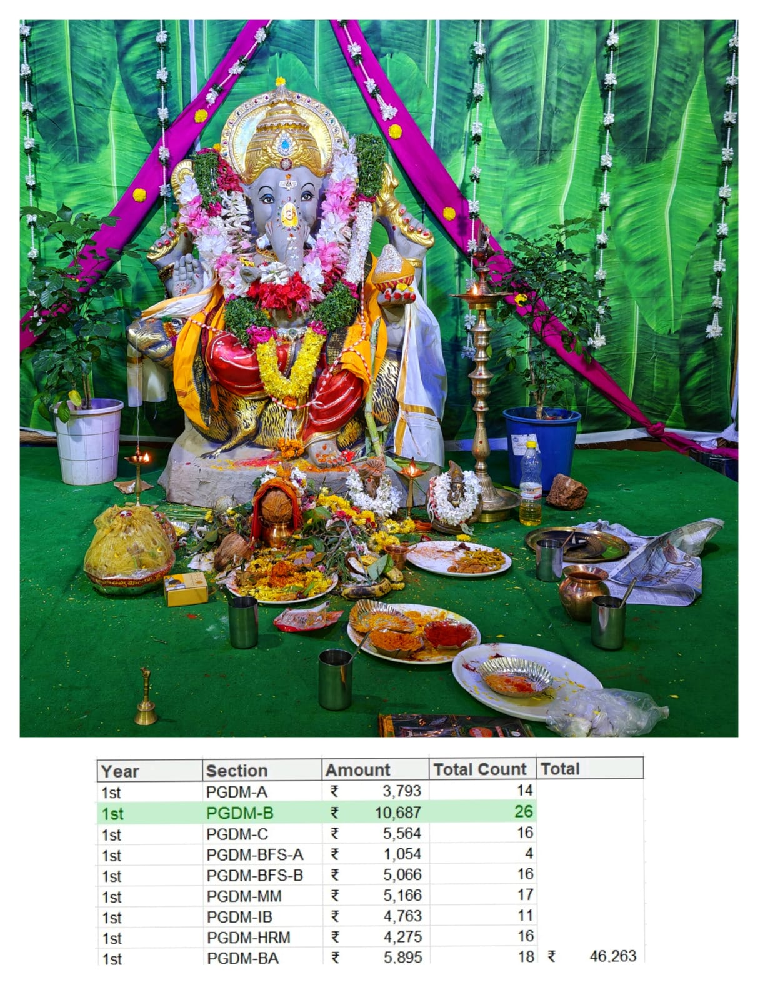

### 1. Ganesh Chaturthi 2025
Collaborated with the Cultural Club of Institute of Public Enterprise (IPE) and raised funds for the Ganesh Chaturthi. As the Senior Class Representative (SCR) of PGDM - equivalent to MBA Section-B, lead a team though which we raised a maximum amount of <code>Rs. 10687</code> in the college and which was <code>approx. 2x more </code> than the one which raised the second highest amount. Even most students contributed from our section only showing true meaning of cultural spirit and unity.

Check out the dataset also for more information of other classes and the contributions made by the seniors.

<B>Ganpati Bappa Morya</B>