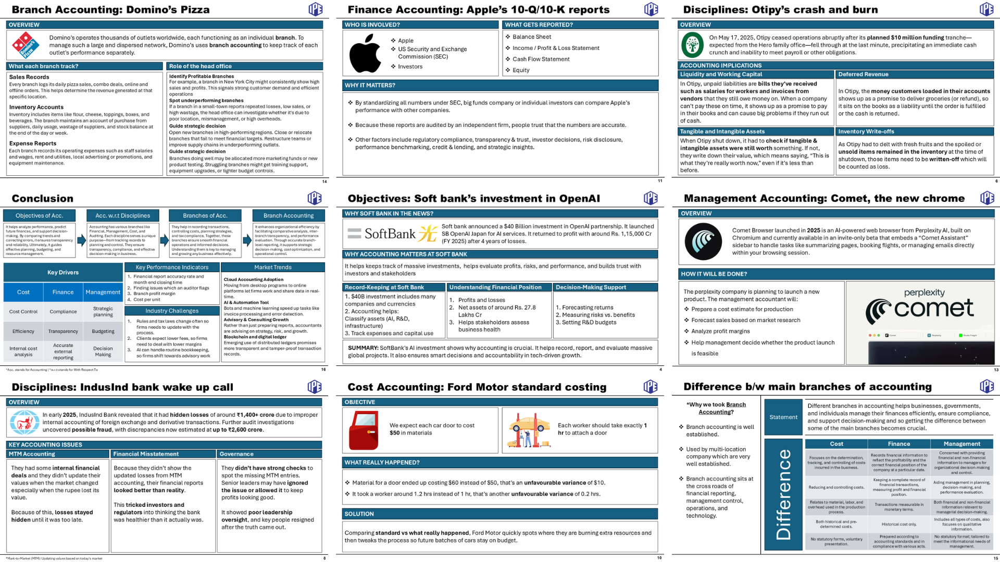

# Accounting for Managers

This directory contains the assignments of **Accounting for Managers**.

## 1. Fundamentals of Accounting

As a team lead executed this assignment with team of 4 students and created the final report. The task came out to be best in PGDM (MBA equivalence) class. 

It is the study of the basic principles and concepts that form the foundation of financial record-keeping and reporting.  

### Topics it covered:
1. Objectives of Accounting
2. Accounting w.r.t other Disciplines
3. Branches of Accounting
4. Difference between main branches of accounting

### Case Studies which are covered:
1. Soft bank's investment in OpenAI
2. Otipy's crash and burn
3. IndusInd bank wake up call
4. Ford motor standard costing
5. Apple's 10-Q/10-K reports
6. Comet, the new chrome
7. Domino's Pizza

We also mentioned some of the usage of **Zoho Book** product.
