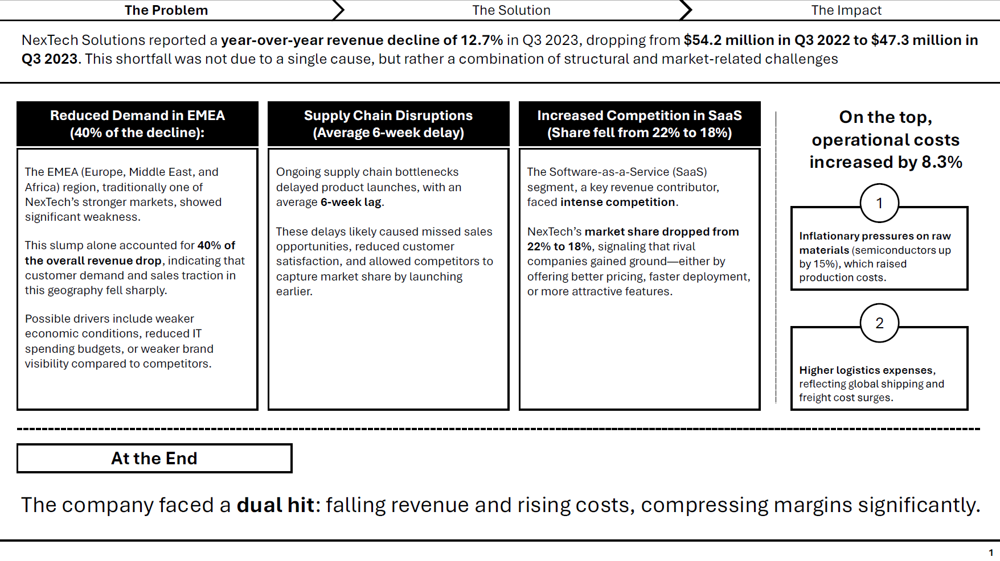

# Personality Development and Business Communication

## 1. Presentation

Given a presentation on the topic NextTech Solution quarter 3 (Q3) performance analysis.

As a task, we needed to create a presentation using the given data:

<code>NexTech Solutions experienced a 12.7% year-over-year revenue decline in Q3 2023, totaling $47.3M compared to $54.2M in Q3 2022. This underperformance was attributed to three primary factors: reduced demand in the EMEA region (accounting for 40% of the revenue drop), supply chain disruptions delaying product launches by an average of 6 weeks, and increased competition in the SaaS segment, where market share fell from 22% to 18%. Operational costs rose by 8.3% due to inflationary pressures on raw materials (notably semiconductors, up 15%) and higher logistics expenses. However, the APAC region showed resilience with 5% growth, driven by strong adoption of NexTech’s cloud analytics platform. Mitigation strategies include renegotiating supplier contracts, accelerating the rollout of the next-gen AI product suite (moved from Q1 2024 to Q4 2023), and doubling the digital marketing budget in EMEA to regain visibility. Projections indicate a potential 4-6% revenue rebound in Q4 if these measures are implemented effectively.</code>

Lead a team of 3 students and effectively conveyed the presentation.
### Screenshot

